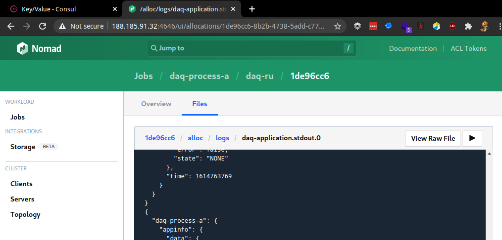

# Running the march demo on LXPlus

## Step 0 - go to LXPlus
```bash
$ ssh lxplus #duh
$ git clone https://github.com/Juravenator/DUNE-RC-RC.git
$ cd DUNE-RC-RC
$ git checkout march-rc0
```

## Run Run Control in-memory

```bash
$ hacks/runInMem.sh
WARNING
This is NOT a production setup
checking if consul is installed
...
the CLI is available at .../DUNE-RC-RC/cli/build/run-control
for convenience, you could run:
export PATH="..."
```

You just received an `export` command to copy paste, please do.
```bash
$ export ...
```

Do NOT forget to be nice and stop RC after you're done:
```
$ hacks/stopInMem.sh
```

You can now access both Consul and Nomad on ports 8500 and 4646 respectively.
(provided you have a tunnel setup using `ssh -D 0.0.0.0:6666 lxplus` + foxyproxy or equivalent)
```bash
$ ip addr
...
    inet 188.185.91.32/23
...
```
  


## Build DAQ code

Before we can run listrev, we need to build it.
```bash
docs/lxplus-demo/build-daq.sh
```

## Run DAQ Applications

```bash
$ run-control apply docs/lxplus-demo/configs/*.json
committing consul transaction... OK
running nomad job daq-process-a... OK
running nomad job daq-process-b... OK
$ run-control get all
KIND		NAME
daq-application	daq-app-a
daq-application	daq-app-b
nomad-job	daq-application-manager
nomad-job	daq-process-a
nomad-job	daq-process-b
daq-config	my-first-config
```

You can view the status of a daq-application resource

```bash
$ run-control get daq-application daq-app-a
{
  "meta": {
    "kind": "daq-application",
    "name": "daq-app-a"
  },
  "spec": {
    "configkey": "/daq-configs/my-first-config",
    "daq-service": "daq-process-a",
    "desired-state": "running",
    "enabled": false,
    "run-number": "123"
  },
  "status": {
    "configkeyexists": true,
    "configrendered": true,
    "daqserviceexists": true
  }
}
```

Notice that autonomous mode is disabled (`"enabled": false,`).

### viewing logs

You can traverse the nomad web interface to view stdout and stderr logs (and scheduler logs if you're in hell).



## Enabling autonomous mode

In autonomous mode, Run Control will send commands to DAQ applications on your behalf.

```bash
$ run-control daq autonomous true daq-app-a daq-app-b
enabling autonomous mode for daq application daq-app-a... committing consul transaction... OK
OK
enabling autonomous mode for daq application daq-app-b... committing consul transaction... OK
OK
$ run-control get daq-application daq-app-a
{
  "meta": {
    "kind": "daq-application",
    "name": "daq-app-a"
  },
  "spec": {
    "configkey": "/daq-configs/my-first-config",
    "daq-service": "daq-process-a",
    "desired-state": "running",
    "enabled": true,
    "run-number": "123"
  },
  "status": {
    "commandsucceeded": true,
    "commandtimedout": false,
    "configkeyexists": true,
    "configrendered": true,
    "daqserviceexists": true,
    "lastcommandsent": "start"
  }
}
```

In the logs of the daq-applications, you can confirm this:
```
2021-Mar-03 10:45:37,978 LOG [dunedaq::restcmd::RestEndpoint::handleResponseCommand(...) at /tmp/listrev-rc-demo/listrev-app/sourcecode/restcmd/src/RestEndpoint.cpp:100] Sending POST request to 127.0.0.1:38187/response
2021-Mar-03 10:45:37,986 LOG [dunedaq::restcmd::RestEndpoint::handleResponseCommand(...) at /tmp/listrev-rc-demo/listrev-app/sourcecode/restcmd/src/RestEndpoint.cpp:107] Response code = OK
2021-Mar-03 10:45:38,083 LOG [dunedaq::restcmd::RestEndpoint::handleResponseCommand(...) at /tmp/listrev-rc-demo/listrev-app/sourcecode/restcmd/src/RestEndpoint.cpp:100] Sending POST request to 127.0.0.1:33440/response
2021-Mar-03 10:45:38,085 LOG [dunedaq::restcmd::RestEndpoint::handleResponseCommand(...) at /tmp/listrev-rc-demo/listrev-app/sourcecode/restcmd/src/RestEndpoint.cpp:107] Response code = OK
2021-Mar-03 10:45:38,216 LOG [dunedaq::restcmd::RestEndpoint::handleResponseCommand(...) at /tmp/listrev-rc-demo/listrev-app/sourcecode/restcmd/src/RestEndpoint.cpp:100] Sending POST request to 127.0.0.1:56308/response
2021-Mar-03 10:45:38,225 LOG [dunedaq::restcmd::RestEndpoint::handleResponseCommand(...) at /tmp/listrev-rc-demo/listrev-app/sourcecode/restcmd/src/RestEndpoint.cpp:107] Response code = OK
```

And in the daq application manager logs:
```
INFO:waitForUpdate:raft update received
INFO:main:received new change 2510: ['daq-applications/daq-app-a', 'daq-applications/daq-app-b']
INFO:manage:managing daq-applications/daq-app-a
INFO:manage:setting up response listener on 38187
INFO:manage:sending command init to 127.0.0.1:30232
INFO:manage:received response 'OK' for command 'init'
```

### Disabling autonomous mode

We'll be sending commands manually next, so let's disable autonomous mode.

```bash
$ run-control daq autonomous false daq-app-a daq-app-b
disabling autonomous mode for daq application daq-app-a... committing consul transaction... OK
OK
disabling autonomous mode for daq application daq-app-b... committing consul transaction... OK
OK
```

## Sending commands

```bash
$ run-control daq command init daq-app-a daq-app-b
fetching daq application... OK
fetching daq application... OK
querying location of daq application... OK
querying location of daq application... OK
generating config... OK
generating config... OK
setting up return path... OK
setting up return path... OK
sending init command to daq-app-a... OK
sending init command to daq-app-b... OK
waiting for return path... OK
waiting for return path... OK
```

You can also enable debug logging to get more verbose info
```bash
$ run-control -l debug daq command conf daq-app-a
10:02AM DBG preparing to send command command=conf name=daq-app-a pkg=main
fetching daq application... 10:02AM DBG fetching key id=daq-app-a kind=daq-application pkg=internal url=http://localhost:8500/v1/kv/daq-applications/daq-app-a?raw=
OK
querying location of daq application... OK
generating config... 10:02AM DBG fetching key id=my-first-config kind=daq-config pkg=internal url=http://localhost:8500/v1/kv/daq-configs/my-first-config?raw=
OK
setting up return path... 10:02AM DBG opened return path pkg=daq port=45099
OK
sending conf command to daq-app-a... OK
waiting for return path... 10:02AM DBG received request method=POST pkg=daq url=/response
10:02AM DBG response received body="{\"data\":{\"ans-host\":\"127.0.0.1\",\"ans-port\":\"45099\",\"cmdid\":\"conf\"},\"result\":\"OK\",\"success\":true}" pkg=daq result=OK
10:02AM DBG openReturnPath() returned daqResponse=OK pkg=daq
OK

$ run-control -l debug daq command conf daq-app-b
10:02AM DBG preparing to send command command=conf name=daq-app-b pkg=main
fetching daq application... 10:02AM DBG fetching key id=daq-app-b kind=daq-application pkg=internal url=http://localhost:8500/v1/kv/daq-applications/daq-app-b?raw=
OK
querying location of daq application... OK
generating config... 10:02AM DBG fetching key id=my-first-config kind=daq-config pkg=internal url=http://localhost:8500/v1/kv/daq-configs/my-first-config?raw=
OK
setting up return path... 10:02AM DBG opened return path pkg=daq port=41951
OK
sending conf command to daq-app-b... OK
waiting for return path... 10:02AM DBG received request method=POST pkg=daq url=/response
10:02AM DBG response received body="{\"data\":{\"ans-host\":\"127.0.0.1\",\"ans-port\":\"41951\",\"cmdid\":\"conf\"},\"result\":\"OK\",\"success\":true}" pkg=daq result=OK
10:02AM DBG openReturnPath() returned daqResponse=OK pkg=daq
OK

$ run-control -l debug daq command start daq-app-a daq-app-b
10:02AM DBG preparing to send command command=start name=daq-app-b pkg=main
fetching daq application... 10:02AM DBG fetching key id=daq-app-b kind=daq-application pkg=internal url=http://localhost:8500/v1/kv/daq-applications/daq-app-b?raw=
10:02AM DBG preparing to send command command=start name=daq-app-a pkg=main
fetching daq application... 10:02AM DBG fetching key id=daq-app-a kind=daq-application pkg=internal url=http://localhost:8500/v1/kv/daq-applications/daq-app-a?raw=
OK
querying location of daq application... OK
querying location of daq application... OK
generating config... 10:02AM DBG fetching key id=my-first-config kind=daq-config pkg=internal url=http://localhost:8500/v1/kv/daq-configs/my-first-config?raw=
OK
generating config... 10:02AM DBG fetching key id=my-first-config kind=daq-config pkg=internal url=http://localhost:8500/v1/kv/daq-configs/my-first-config?raw=
OK
setting up return path... 10:02AM DBG opened return path pkg=daq port=35195
OK
sending start command to daq-app-a... OK
setting up return path... 10:02AM DBG opened return path pkg=daq port=44395
OK
sending start command to daq-app-b... OK
waiting for return path... OK
waiting for return path... 10:02AM DBG received request method=POST pkg=daq url=/response
10:02AM DBG received request method=POST pkg=daq url=/response
10:02AM DBG response received body="{\"data\":{\"ans-host\":\"127.0.0.1\",\"ans-port\":\"35195\",\"cmdid\":\"start\"},\"result\":\"Command start was not executed correctly by: lr, lrv, rdlg, \",\"success\":false}" pkg=daq result="Command start was not executed correctly by: lr, lrv, rdlg, "
10:02AM DBG response received body="{\"data\":{\"ans-host\":\"127.0.0.1\",\"ans-port\":\"44395\",\"cmdid\":\"start\"},\"result\":\"Command start was not executed correctly by: lr, lrv, rdlg, \",\"success\":false}" pkg=daq result="Command start was not executed correctly by: lr, lrv, rdlg, "
10:02AM DBG openReturnPath() returned daqResponse="Command start was not executed correctly by: lr, lrv, rdlg, " pkg=daq
10:02AM DBG openReturnPath() returned daqResponse="Command start was not executed correctly by: lr, lrv, rdlg, " pkg=daq
FAIL
FAIL
10:02AM DBG daqresponse daqresponse="Command start was not executed correctly by: lr, lrv, rdlg, " pkg=daq
10:02AM ERR command failed error="Command start was not executed correctly by: lr, lrv, rdlg, " name=daq-app-b pkg=main
10:02AM DBG daqresponse daqresponse="Command start was not executed correctly by: lr, lrv, rdlg, " pkg=daq
10:02AM ERR command failed error="Command start was not executed correctly by: lr, lrv, rdlg, " name=daq-app-a pkg=main
command failed, not all DAQ commands succeeded
```

## starting over

When you do something wrong, you might be stuck running any command and receive something like this
```
10:10AM ERR command failed error="Command start not allowed. state: NONE, error: 0, busy: 1" name=daq-app-a pkg=main
10:10AM ERR command failed error="Command start not allowed. state: NONE, error: 0, busy: 1" name=daq-app-b pkg=main
```

To re-run daq-applications and reset RC state:
```bash
# re-apply configs, resets autonomous mode to false and wipes state
run-control apply docs/lxplus-demo/configs/*.json
# kill daq_applications, nomad will restart them
killall daq_application
```

## cycling through runs

The correct sequence of commands is:  
`init` -> `conf` -> `start` -> `stop` -> `start` -> `stop` -> ...  
`init` should only be run once

The cli accepts `--run-number` as a flag when sending commands. You can use it to configure a new run number when sending init commands.
```bash
$ run-control daq command --run-number 42 init daq-app-a daq-app-b
$ run-control daq command conf daq-app-a daq-app-b
$ run-control daq command start daq-app-a daq-app-b
$ run-control daq command stop daq-app-a daq-app-b
$ run-control daq command --run-number 43 start daq-app-a daq-app-b
$ run-control daq command stop daq-app-a daq-app-b
$ run-control daq command --run-number 44 start daq-app-a daq-app-b
```
The new run number is persistent
```bash
$ run-control get daq-application daq-app-a
{
  "meta": {
    "kind": "daq-application",
    "name": "daq-app-a"
  },
  "spec": {
    "configkey": "/daq-configs/my-first-config",
    "daq-service": "daq-process-a",
    "desired-state": "running",
    "enabled": false,
    "run-number": "42"
  },
  "status": {
    ...
  }
}
```

## Stopping 

```
$ hacks/stopInMem.sh
```
This will stop RC and all applications that it was running.
