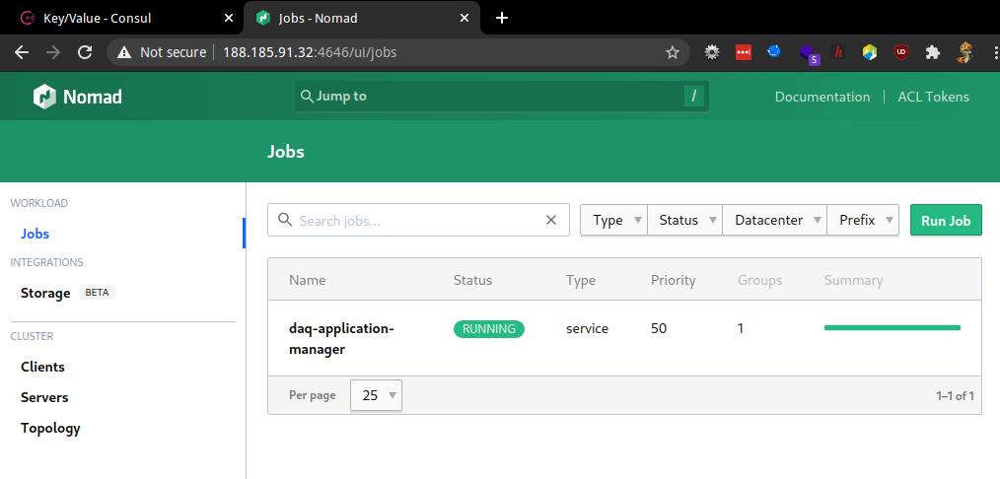

# Running the march demo on LXPlus

## Step 0 - go to LXPlus
```bash
$ ssh lxplus #duh
$ git clone https://github.com/Juravenator/DUNE-RC-RC.git
$ git checkout <hash>
```

## Run Run Control in-memory

```bash
$ hacks/runInMem.sh
WARNING
This is NOT a production setup
checking if consul is installed
...
the CLI is available at .../DUNE-RC-RC/cli/build/run-control
for convenience, you could run:
export PATH="..."
```

You just received an `export` command to copy paste, please do.

You can now access both Consul and Nomad on ports 8500 and 4646 respectively.
(provided you have a tunnel setup using `ssh -D 0.0.0.0:6666 lxplus` + foxyproxy or equivalent)
```bash
$ ip addr
...
    inet 188.185.89.246/23
...
```
  


## Run DAQ Applications

```bash
$ run-control apply docs/lxplus-demo/configs/*.json
committing consul transaction... OK
running nomad job daq-process-a... OK
$ run-control get all
KIND		NAME
daq-application	daq-app-a
nomad-job	daq-application-manager
nomad-job	daq-process-a
daq-config	my-first-config
```

### viewing logs

You can traverse the nomad web interface to view stdout and stderr logs (and scheduler logs if you're in hell).

## Enabling autonomous mode

### Disabling autonomous mode

## Sending commands

If you see an error message `connection refused`, it probably means daq-application is still building/starting. Check the logs.

```bash
$ run-control daq command init daq-app-a
fetching daq application... OK
querying location of daq application... OK
generating config... OK
setting up return path... OK
sending init command to daq-app-a... 11:20PM ERR command failed error="Post \"http://127.0.0.1:21828/command\": dial tcp 127.0.0.1:21828: connect: connection refused" name=daq-app-a pkg=main
command failed, not all DAQ commands succeeded
```